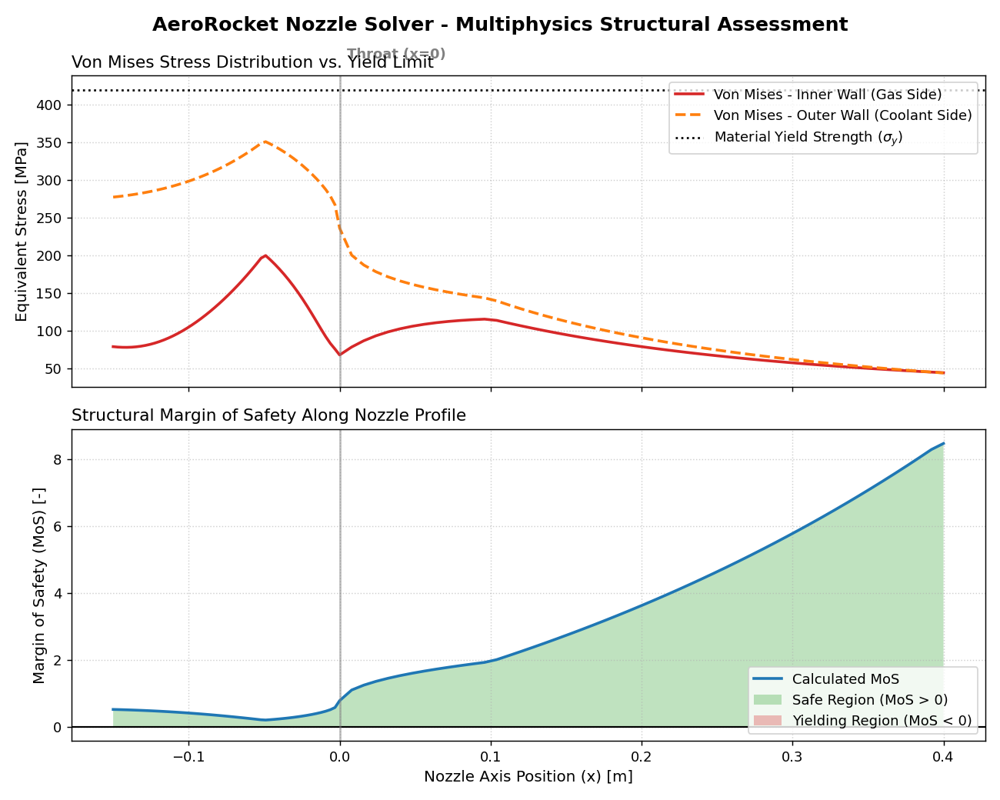

# Nozzle Solver

A coupled quasi-1D multiphysics solver for the thermo-structural assessment of liquid rocket engine nozzles. The framework integrates gas dynamics, high-temperature convective heat transfer (Bartz correlation), and thick-wall structural mechanics (Von Mises yield criterion) to evaluate nozzle wall integrity under representative operating loads.

## Project Overview

This project simulates a regeneratively cooled copper-alloy (Cu-Cr-Zr / GRCop-84 class) rocket nozzle operating at a chamber pressure of 70 bar and a combustion temperature of 3300 K.

The solver couples three disciplines sequentially, each module consuming the output of the previous one:

1. **Gas Dynamics (CFD):** solves the quasi-1D isentropic flow equations along the nozzle axis to obtain the Mach number, static pressure, and static temperature profiles from the area-Mach relation.
2. **Thermal Analysis:** computes the gas-side convective heat transfer coefficient with the Bartz correlation and solves a 1D radial thermal resistance network (gas film → wall conduction → coolant film) at each axial station, using a variable wall thickness profile.
3. **Structural Mechanics:** evaluates the combined pressure + thermal Von Mises equivalent stress on both the inner (gas-side) and outer (coolant-side) wall surfaces using thick-cylinder (Lamé) theory, and reports the resulting Margin of Safety (MoS) against yield.

## Repository Structure

- `propulsion_cfd.py` — nozzle geometry definition and quasi-1D isentropic flow solver.
- `thermal_bartz.py` — Bartz gas-side heat transfer coefficient, variable wall-thickness profile, and radial thermal resistance network.
- `RocketNozzleStructural.py` — Lamé thick-cylinder pressure stress, thermal stress, Von Mises combination, and Margin of Safety.
- `nozzle_solver.py` — main script coupling the three modules and printing a results summary at the inlet, throat, and exit sections.
- `plot_results.py` — post-processing script generating the Von Mises stress and Margin of Safety plots.

## Physical Model & Key Assumptions

- **Gas dynamics:** inviscid, quasi-1D, isentropic flow of a calorically perfect gas (constant γ, R). No boundary layer, shocks, or flow separation are modeled. The exit condition corresponds to the geometric (frozen) area ratio, independent of back-pressure.
- **Heat transfer:** the Bartz correlation gives the gas-side film coefficient `h_g`; the wall is treated as a 1D radial resistance stack (gas film + conduction + coolant film) at each station — no axial conduction, no coolant temperature rise along the channel (`T_cool` is held constant).
- **Wall thickness:** the wall tapers linearly from 4.0 mm in the chamber to a 1.2 mm minimum at the throat, then back out to a steady 2.0 mm over the first 100 mm of the divergent section — a simplified, manually assumed profile rather than the output of a thickness-optimization routine.
- **Structural model:** thick-cylinder (Lamé) hoop and axial stress from the local pressure difference, superimposed with a 1D thermal stress term (`σ = EαΔT / [2(1-ν)]`) from the radial temperature gradient across the wall. Combined with Von Mises' criterion at the inner and outer surfaces; radial stress is approximated by the local boundary pressure.
- **Material:** single set of temperature-independent properties (E, α, ν, σ_y), representative of a copper-alloy liner at reference conditions.

## Material Properties

| Property | Value |
|---|---|
| Young's Modulus (E) | 110 GPa |
| Coefficient of Thermal Expansion (α) | 17×10⁻⁶ K⁻¹ |
| Poisson's Ratio (ν) | 0.33 |
| Yield Strength (σ_y) | 420 MPa |
| Thermal Conductivity (k_w) | 320 W/m·K |

## Results

*Fig. 1 – Von Mises stress distribution (top) and structural Margin of Safety (bottom) along the nozzle axis. The vertical line marks the throat (x = 0).*

| Section | x [m] | Gas Pressure [bar] | Wall Temp In/Out [K] | Von Mises In/Out [MPa] | MoS |
|---|---|---|---|---|---|
| Inlet | −0.150 | 69.6 | 776.2 / 674.7 | 78.9 / 277.5 | 0.513 |
| Throat | 0.000 | 39.2 | 1485.5 / 1388.2 | 67.9 / 236.4 | 0.776 |
| Exit | 0.400 | 1.0 | 584.0 / 552.4 | 44.3 / 44.0 | 8.482 |

The global minimum Margin of Safety along the full profile is **MoS = 0.196**, located just upstream of the throat (x ≈ −0.049 m), on the chamber side of the convergent taper, not at the three summary sections above.

### 1. Outer wall governs the combined stress

Along nearly the entire nozzle, the **outer (coolant-side) wall carries the higher Von Mises stress**, not the inner one. This follows directly from how the pressure and thermal stress components combine at each surface:

- At the **inner (hot) surface**, the pressure-induced hoop stress is tensile, while the thermal stress is *compressive* (the hot inner layer wants to expand but is restrained by the cooler material behind it), the two partially cancel, reducing the net stress.
- At the **outer (cold) surface**, both the pressure and thermal contributions are tensile and reinforce each other, pushing the combined Von Mises stress higher, closer to, though still comfortably below, σ_y.

This is visible in Fig. 1: the dashed orange curve (outer wall) sits above the solid red curve (inner wall) essentially everywhere except right at the exit, where the pressure difference has decayed to nearly zero and both curves converge.

### 2. Throat region as the structural minimum

The minimum wall thickness (1.2 mm) is imposed at the throat to limit the conductive thermal resistance (`R_th = t_w / k_w`) and keep the heat-flux-driven temperature gradient across the wall manageable, a thinner wall lets heat pass to the coolant more easily. This is a **trade-off, not a free win**: the same thin wall also has less material to react the 70 bar chamber pressure. The combined Von Mises stress stays below yield in this run, but the true structural minimum (MoS = 0.196) sits just upstream of the throat, on the convergent side, where the wall is still tapering down and the chamber pressure is close to its peak.

### 3. Divergent section over-design

The Margin of Safety rises sharply through the divergent section, exceeding 8 near the exit. As the flow expands supersonically, the static pressure decays toward ambient while the wall thickness is held at a constant 2.0 mm, the driving mechanical load drops much faster than the material cross-section does, so the aft nozzle is significantly over-designed structurally. This points to a clear optimization path: a thickness profile that tapers down through the divergent section (rather than holding a flat 2.0 mm) would recover unnecessary copper mass without compromising the margin, directly benefiting payload capacity.

## Known Limitations

This model is a first-order engineering tool and has known simplifications worth stating explicitly:

- **Temperature-independent yield strength.** `σ_y = 420 MPa` is applied uniformly regardless of local wall temperature. The throat inner-wall temperature (1485.5 K) exceeds the melting point of pure copper (1358 K) and is well above the practical service limit of Cu-Cr-Zr / GRCop-84 alloys (~800–1000 K); a real liner would lose most of its strength at that temperature, so the MoS reported at the throat should be read as optimistic. Introducing a temperature-dependent `σ_y(T)` (even a coarse lookup table) is the highest-value next step. The elevated wall temperature is primarily driven by the assumed coolant-side film coefficient (`h_c = 25 000 W/m²K`), which is on the lower end for regeneratively cooled channels, sensitivity checks show that raising `h_c` reduces the wall temperature but *increases* the through-wall thermal gradient (and hence thermal stress) at the throat, since more heat is being extracted through the same thickness. A single-wall design cannot fully satisfy both constraints at once with this geometry, a dual-wall architecture (thin conductive hot-wall liner + separate structural jacket), as used in real regeneratively cooled chambers, is the natural next iteration.
- **No safety factor.** MoS is computed as `σ_y/σ_vm − 1`; a design safety factor (typically 1.25–1.5 in aerospace practice) is not applied.
- **Thin-wall pressure stress approximation.** The Lamé hoop/axial stress terms treat the net pressure difference `ΔP = P_gas − P_amb` as if it were a purely internal pressure; this is standard practice when `P_gas ≫ P_amb`, but becomes an approximation near the exit, where `P_gas` drops below `P_amb`.
- **No buckling check.** Near the nozzle exit, `P_gas < P_amb`: the wall is under net *external* pressure. For a thin shell (2 mm wall over a 240 mm diameter), the governing failure mode there is elastic buckling, not yield, a mode the Von Mises/MoS criterion does not capture. A first-order Euler-type critical pressure check (`P_cr = E/[4(1−ν²)]·(t/R)³`) is a natural addition.
- **No axial conduction / constant coolant temperature.** The thermal network is purely radial (1D) at each station, and `T_cool` is held fixed along the full channel length rather than rising as it absorbs heat.
- **Idealized gas dynamics.** Isentropic, inviscid, calorically perfect gas; no boundary layer, shocks, flow separation, or real-gas/dissociation effects.

## Validation Notes

The CFD module was checked against closed-form isentropic relations: for the chosen geometry (throat/exit diameter ratio of 3, area ratio 9) and γ = 1.22, the analytical area-Mach relation gives an exit Mach number of 3.26 with P/P_c = 0.0136 and T/T_c = 0.461, both matching the solver output to three significant figures. The input `Cp = 2000 J/kg·K` is also consistent with `γR/(γ−1) = 1996 J/kg·K` for the assumed γ and R, confirming the thermodynamic property set is self-consistent.
